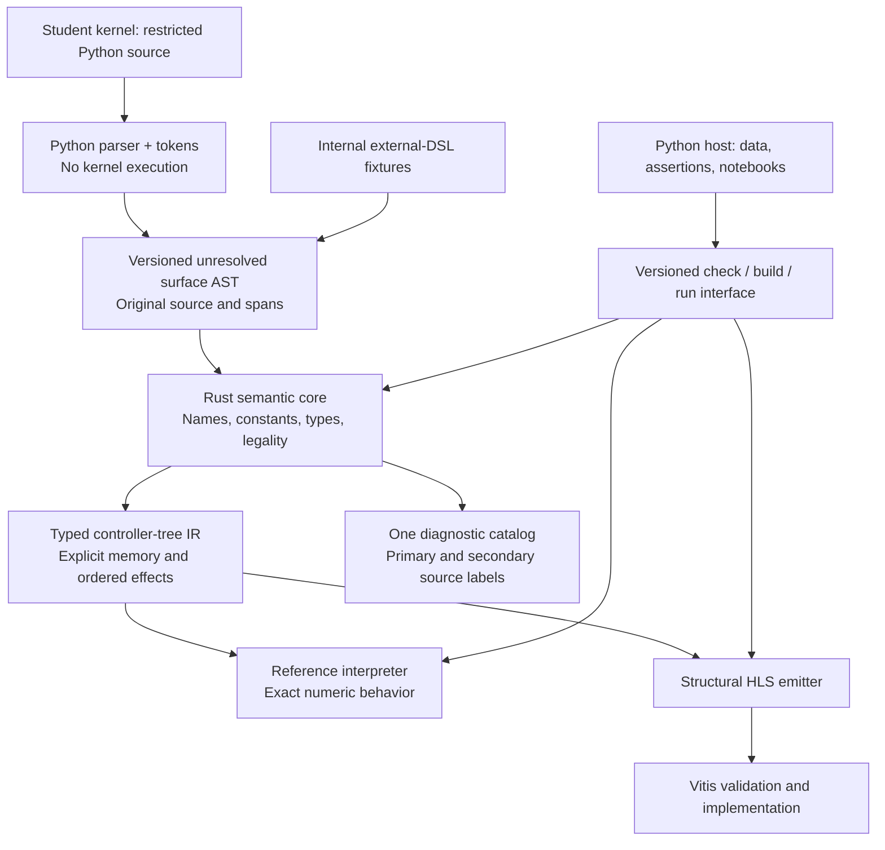

## Selected architecture

**Select R-E: a restricted Python-syntax kernel language, captured from source without execution, over one Rust semantic compiler, controller-tree IR, reference interpreter, and structural HLS backend.** Deliver Python host/testbench tools and a bundled compiler executable through wheels. Use a process/JSON interface first. Do not require native Python bindings in the first release.

This is the final research recommendation submitted for approval. Implementation is pending professor approval. It replaces the meeting cut's provisional R-X recommendation; the frozen protocol and historical results remain in [[D-26]]. It does not claim universal mathematical optimality or a measured learning advantage.

The choice gives the professor's stated interest in familiar student authoring priority over minimizing the number of frontend interfaces, while preserving the existing hardware contract. David confirmed on 2026-09-28 that the team has the necessary maintenance skills; language familiarity of maintainers is not a discriminator. Python kernel syntax has not been established as a mandatory course requirement. This recommendation chooses it as a product judgment, rather than attributing that requirement to the professor.

## Architecture and ownership

Everything in this diagram is the approved target if the proposal is accepted, not a claim that the full pipeline exists today. The existing CLI implements text `check`; it does not yet supply the proposed Python frontend, JSON command set, wheels, or general interpreter. Source: `spatial-rs@eb49d8b:crates/spatial-rs-cli/src/lib.rs:12-77`; [[D-26-05-boundary-design]].

| Layer | Owns | Does not own |
|---|---|---|
| Python kernel frontend | Python parsing; closed-subset recognition; original tokens, source snapshots and spans; unresolved AST construction | Spatial name resolution, constant arithmetic, types, initialization, bounds or hardware legality |
| Rust semantic core | Ingress validation; source-ordered names; exact constants; typing; normative proof and effect rules; deterministic diagnostics | Python host evaluation or a second frontend-specific language contract |
| Typed controller-tree IR | Explicit controllers, regions, memory objects, typed expressions, ordered effects, origin information and verified obligations | Whole-program family names as semantics; HLS strings as types |
| Reference interpreter | Executable functional behavior of the checked IR | Cycle accuracy, achieved initiation interval, device resource fit |
| Structural HLS backend | Compositional lowering of checked nodes and the same numerical/effect contract | Silently accepting programs rejected by the shared checker |
| Python host and notebook tools | Input generation, invocation, output assertions, plots, source display | A second simulator or legality checker |

The controller-tree inversion follows the adopted [[2026-07-07-fundamental-design-review]]. The current parse → constants → HIR → classifier route supplies reusable parts, not a general compiler: `spatial-rs@eb49d8b:crates/spatial-rs-core/src/compiler.rs:30-67`.

## The student contract

Students write two visibly distinct things: **kernel source compiled under Spatial's hardware rules**, and **ordinary Python testbenches executed by Python**. The kernel file is read as text; importing or executing it is not the compilation mechanism. A notebook adapter registers the exact cell text before capture. Python import statements, function definitions, annotations and decorators admitted by the subset are declarative syntax; the loader does not execute them, evaluate defaults or import arbitrary modules. Unsupported syntax receives frontend diagnostics. Unresolved names, including attempted implicit host captures, are rejected by the shared Rust resolver; the frontend does not implement a second name-resolution policy.

The initial source forms derive from the AST listings in [[D-26-02-student-surface-comparison]]. `seq`, `auto`, `fold`, `memfold`, memory declarations and transfers remain explicit hardware intrinsics. File/cell capture removes the need to execute annotations or recover a live function with `inspect`; the old listing counts are not silently recomputed for this new design.

The subset specification must explicitly teach these differences from ordinary Python:

| Topic | Required behavior |
|---|---|
| Numbers | `Int` and parameterized `FixPt` retain Spatial widths, overflow and per-operator normalization. Decimal spelling comes from source tokens, never a Python float value. |
| Constants | Distinguish compile-time `Size` expressions from runtime integers; preserve definitions and uses until the Rust checker resolves them. |
| Names and state | Preserve the declared lexical scope, declaration order, and distinction between binding and hardware-state mutation. Reject unsupported Python rebinding patterns. |
| Effects | Preserve left-to-right operands and Spatial's target-indices-before-RHS assignment order. Immediate FIFO consumption makes this observable. Use explicit temporaries in teaching examples. |
| Control | Compile both source branches structurally; never discover control by executing the kernel with sample values. Reject unsupported chained comparisons and host truth conversion. |
| Storage and scheduling | Keep transfers, initialization, lane requests, tails and memory resources explicit. Familiar punctuation does not remove these hardware concepts. |

Normative anchors: `spatial-rs@eb49d8b:docs/language-spec.md:385-420`, `spatial-rs@eb49d8b:docs/language-spec.md:682-710`, `spatial-rs@eb49d8b:docs/language-spec.md:816-841`. These are requirements on the new frontend, not demonstrated implementation coverage. Python's AST includes positions and Python-valued constants; that is why raw tokens and immutable source text are retained separately. [Python AST documentation](https://docs.python.org/3/library/ast.html) (accessed 2026-09-28).

## One semantic authority across the boundary

The new ingress carries an **unchecked** surface AST. It includes a version, source IDs and immutable text, UTF-8 byte ranges for every node/subexpression, original literal spellings, unresolved identifiers, declaration order, and explicit generated-origin markers. Rust validates schema versions, node shapes, source IDs and span boundaries before semantic work. Both primary uses and relevant secondary declarations must survive transformations.

The Python frontend may reject Python syntax and unsupported subset forms. It must not precompute Spatial constants, infer types or prove legality. Sending already-checked IR would either duplicate these rules or move semantic ownership; that is a different architecture. [[D-26-05-boundary-design]] compares the boundaries and records why mere source metadata is not end-to-end diagnostic parity.

One diagnostic catalog supplies stable codes, message templates and help. Rust produces structured facts and labels; terminal/Python/notebook renderers consume the same records. The catalog is a versioned, validated resource editable without rebuilding Rust; changing a semantic rule still requires a core change. Catalog mismatch fails clearly. Proposed diagnostic fields follow `spatial-rs@eb49d8b:docs/adr/0002-file-cli-host-runtime.md:504-557`.

The checked IR represents arbitrary supported compositions. Initialization, bounds, dependence and schedule checks implement the closed normative rules, including defined rejection where a proof fails. Stronger solvers must not silently change accepted programs. Functional interpretation and HLS lowering consume that same checked meaning. Sources: `spatial-rs@eb49d8b:docs/language-spec.md:424-443`; `spatial-rs@eb49d8b:docs/language-spec.md:470-510`.

## Why this choice wins the engineering decision

| Alternative | Strongest case | Reason not selected |
|---|---|---|
| **R-X: Rust + external DSL** | Explicit independent syntax; no Python-AST transport boundary; useful existing frontend pieces | Both designs can preserve the hardware contract. We prioritize familiar student authoring over R-X's simpler boundary and deliberately accept R-E's extra integration work. R-X remains a legitimate choice under a different product priority. |
| **P-E: Python core + Python syntax** | One implementation language; credible compiler precedents; no frontend/core language boundary | It gives the same student syntax while changing the semantic engine. With maintenance skills equal, retaining useful Rust infrastructure and native interpreter headroom is preferable. Python remains technically viable; no blanket impossibility claim is made. |
| **P-X** | A coherent all-Python compiler with explicit syntax | It changes the core without addressing the professor's student-syntax motivation. |
| **R-B / P-B: two public surfaces** | Maximum authoring choice | There is no established need for two supported student products. The required external fixtures are internal conformance infrastructure, not a second public course language. |
| **Tracing** | Short, executable-looking Python programs | Native binding, eager arithmetic and host control can discard information before capture. It is not the sole faithful frontend. |
| **Builder API** | Explicit construction can preserve every mapped obligation | It adds construction machinery to student programs. Keep it as a possible internal implementation technique, not the selected public syntax. |

This table is a transparent design judgment. It is not an invented numerical utility score. The concept inventory and error study do not measure student learning; the AST mapping is a designed preservation argument, not a functioning frontend. See [[D-26-02-student-surface-comparison]], [[D-26-03-error-paths]], [[00 - Python Mapping Overview]] and [[D-26-08-cost]].

The [[D-26-12-simulator-spike|matched interpreter study]] supports native execution headroom for the tested implementation. Its primary ratios exceed the unchanged k=10 threshold and trigger the registered negative condition for the tested pure-CPython interpreter route. The original protocol expressly permits toy-spike evidence; a full compiler is not a new prerequisite. This does not decide Python versus external student syntax, prove all Python compilers slow, or certify an end-to-end release latency. Its absolute times and limitations accompany its ratios.

## All registered Python-surface guarantees remain commitments

The original D-26 protocol requires more than one public frontend's implementation. No guarantee is waived to make R-E look cheaper.

| Registered guarantee | Delivery commitment |
|---|---|
| One IR and diagnostic catalog | Both parsers converge before shared semantic checking; one checked controller tree and catalog govern all semantic behavior. |
| Same mistake, same message in both surfaces | Paired valid/invalid fixtures verify code, message, corresponding primary/secondary spans, recovery and ordering. Surface syntax/subset errors remain explicitly frontend-owned. |
| Every lab maintained in both forms | Every shipped course kernel has a maintained Python form and an internal canonical external form. This is real parser, fixture and CI work included in the plan. |
| No student Rust toolchain | Prebuilt wheels bundle matching client, compiler executable and catalog; test fresh installs on the declared supported platform matrix. |
| CI releases | Reproducible release jobs validate semantic fixtures, wheel installation, CLI/Python contracts and version matching before publication. |
| TA-editable catalog | Validated message/help resources can change independently of the Rust binary; no claim that a text edit changes semantics. |

The existing external parser is retained and completed to the extent required by paired conformance fixtures. It is not declared free, deprecated out of the guarantee, or promoted into a second supported student product.

## Delivery and runtime decisions

Start with the same Rust library pipeline behind a bundled executable and a thin Python client. Use the specified host input/output and diagnostic envelopes; add a separately versioned unresolved-AST envelope. Fixed-point host values remain exact decimal strings rather than JSON floating-point numbers. Source: `spatial-rs@eb49d8b:docs/adr/0002-file-cli-host-runtime.md:159-217`.

Wheels can contain executables without PyO3 bindings; this is a supported packaging mechanism, not an existing Spatial release. [Maturin binary bindings](https://www.maturin.rs/bindings.html) (accessed 2026-09-28). Approve a tested platform matrix before the first course release. The proposed first matrix covers Linux x86-64, macOS arm64/x86-64 and Windows x86-64; these are targets to validate, not current compatibility claims.

Measure process startup, source capture, checking, serialization and interpretation together on actual lab inputs. Add batching or a persistent worker only if measured feedback latency warrants it. Native bindings, zero-copy buffers, MLIR/Calyx replacement backends, automatic design-space search and a cycle-accurate simulator are outside the first delivery. Vitis evidence, not the functional interpreter, establishes hardware outcomes.

## Implementation sequence after approval

| Gate | Deliverable | Evidence required to advance |
|---|---|---|
| **0 — Freeze the contract** | Closed Python subset; unresolved schema; semantic owners; diagnostic catalog; initial lab/platform scope | Enumerate every promised canonical construct and its admitted Python form, including constructs deferred from the thirteen-entry mapping study. Source-only rules cover imports/annotations/captures, scope, numeric tokens and effect order. Specify adversarial fixtures whose side effects in imports, decorators, annotations, defaults and bodies must never execute during capture. Restrictions cannot silently remove promised constructs or effects. |
| **1 — First complete semantic slice** | Dense tiled scale through Python capture and external fixture parsing → shared checker → controller tree → interpreter | Both forms produce equivalent checked meaning and exact outputs. Renaming, changed tiling and recomposition work without a new whole-program classifier case. Nonexecution, origin/span and rejection tests pass. |
| **2 — General semantics** | Representative nested-fold and fixed-point memfold/GEMM semantic slices, then remaining controller/memory families | All thirteen mapping contracts, the remaining Gate-0 construct inventory and applicable normative checks are implemented; all 39 existing corpus programs match independent oracles through the general interpreter; new compositions and valid controls defeat recognition-only shortcuts. Writable direct-DRAM assignment remains a valid control under the present contract, correcting the old study's row-5 assumption without rewriting its results. |
| **3 — Structural backend** | Emit HLS from checked controller nodes, migrate and retire family classifiers progressively | Independent numerical/effect tests; selected fresh Vitis validation whenever generated HLS changes; full supported-roster refresh before course release. Preserve and distinguish historical evidence. |
| **4 — Course release** | Paired labs, diagnostics, package matrix, CLI/Python/notebook tools and tutorial | All six registered E guarantees pass; clean installs require no Rust toolchain; source errors point into original files/cells; agreed absolute feedback budgets pass. |

These are release gates within the selected architecture, not reasons to reopen six architecture options after every defect. Correctness failures are repaired before advancing. Existing incomplete features—including canonical syntax and diagnostic gaps—are work in this plan, not evidence that the gates already pass.

Backend work can begin for each family once that family's semantic gate passes; the table does not require every interpreter family to finish before the first structural backend slice. Early representative GEMM interpretation does not reorder the adopted backend migration ladder: scalar, reductions/memory reductions, FIFO, LUT, FSM, rank-2/Tile-K and stencil. Wheels bundle the local compiler/simulator and client, not the licensed Vitis installation. Hardware validation and any required host-C++ compilation use a separately provisioned, declared vendor-tool environment.

## Risks and approval boundary

The strongest remaining risk is **negative transfer from ordinary Python**: familiar notation may make differing scope, integer or effect rules more surprising. Mitigate it with a visible kernel boundary, a short differences guide, precise diagnostics and finite learner repair exercises. No learner study has established a net advantage yet. A study can improve the surface and tutorial without requiring a new core architecture.

The second risk is frontend integration effort: source snapshots, schema evolution, notebook origins, a shared catalog and paired fixtures are substantive work. The existing external parser's remaining work and a possible pure-Python implementation's advantages were both considered; no person-week estimate or total cost superiority has been measured.

**Approval requested:** adopt this R-E architecture and the staged gates as the implementation direction. Approval concerns the architecture and delivery commitments; it does not certify completed semantics, course readiness, learner superiority, cycle accuracy or fresh hardware results. Until that approval, work remains research and documentation.
