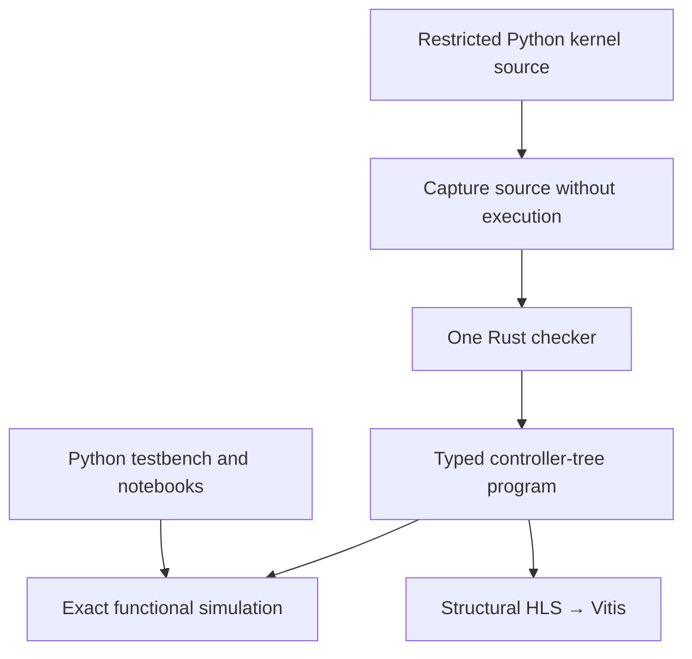

> [!important] Superseded after the professor discussion — 30 September 2026
> The current direction is a pure Python rewrite, beginning with what Spatial programs and the compiler look like in Python, followed by HLS research. This brief records the earlier proposal. See [[2026-09-30-pure-python-programming-model]].

## Recommendation presented — historical

**Build a restricted Python-syntax Spatial frontend over a Rust semantic core.** Parse kernel source without executing it. Use one checker, one controller-tree representation, one functional interpreter and one structural HLS backend. Ship the compiler with Python testbench and notebook tooling through prebuilt wheels.

Students work in a familiar Python environment while the compiler retains explicit hardware rules. The implementation language remains an internal choice: students do not need to learn Rust or install a Rust toolchain on supported, tested release platforms.

This is a selected architecture proposal, pending your approval before implementation. [[D-26-final-architecture|The full plan]] defines ownership, contracts, commitments and delivery gates.

<a href="presentation/index.html" data-router-ignore target="_blank" rel="noopener noreferrer">Open the seven-screen presentation</a>. It covers the Rust prototype, documentation repository and website, proposed architecture, and first implementation milestone. [[2026-09-28-spatial-professor-presentation-outline|Screen outline and speaking plan]].

## The problem the research resolves

The earlier prototype recognizes whole-program families. That provides useful backend experiments and regression cases, but cannot be the foundation of a general language where students compose memory, loops, reductions and state in new ways. The research separates three decisions that were previously conflated: the language students write, the language implementing compiler semantics, and the Python tooling used to run labs.

The recommended solution keeps **one source of semantic truth** while giving students Python syntax. Python captures unresolved source; Rust checks it. The same checked program feeds simulation and HLS emission.

## What the research established

| Evidence | Result | What it does not establish |
|---|---|---|
| Thirteen construct/semantic mappings | A token-backed AST design can retain every recorded information category; unrestricted tracing has concrete loss hazards | A completed Python frontend or proven student learning advantage |
| Same-lab surface comparison | The alternatives expose different language machinery; familiar Python syntax is a credible teaching choice | Raw concept counts are not learning-time measurements |
| Executable diagnostic study | Current external canonical forms hit parser barriers; Exo shows useful early checks; some fixed negative cases were invalid study assumptions | A fair complete semantic/error-parity winner |
| Matched interpreter experiment | The tested Rust interpreter has substantial execution headroom; small Python examples still finish quickly | An impossibility for Python compilers, a course latency guarantee, or an end-to-end hardware speedup |
| Boundary analysis | Unresolved AST plus exact origins allows one shared semantic checker; checked-IR ingress would move or duplicate early rules | Merely carrying line metadata guarantees correct diagnostics |

Sources: [[00 - Python Mapping Overview]], [[D-26-02-student-surface-comparison]], [[D-26-03-error-paths]], [[D-26-12-simulator-spike]], [[D-26-05-boundary-design]]. The original meeting-cut citation audit remains available in [[2026-09-25-d26-citation-audit]]. The follow-up method and disagreement are recorded in [[2026-09-28-d26-research-extension]].

## Why select this over the strongest alternatives?

**Versus Rust plus an external student DSL:** the external language has a simpler frontend boundary and makes its independent semantics obvious. The Python AST alternative can retain the same semantics. We choose to spend the additional integration effort on familiar student authoring, while making the kernel/host distinction explicit. This is a design decision, not a claim that a learner trial proved Python superior.

**Versus a Python compiler core:** students can receive the same Python syntax with either core. With team skills assumed adequate, Rust retains useful compiler infrastructure and native interpreter headroom. Python compiler precedents remain credible; the recommendation does not depend on claiming Python cannot implement static checking.

**Versus supporting both public languages:** one supported course surface gives students and teaching material a clear contract. Paired external fixtures and lab forms remain internal conformance infrastructure, with their real maintenance cost included.

## The important tradeoff to approve knowingly

This is **Python syntax with Spatial hardware semantics**. Kernels are compiled source, not ordinary Python functions executed to discover a graph. Widths, exact fixed-point arithmetic, declaration scope, transfers, initialization, ordered effects and controller legality remain explicit. In particular, source tokens must survive capture, and FIFO effects cannot inherit a different host evaluation order by accident.

We will publish a concise differences guide and require valid/invalid paired cases, precise source labels and repair exercises before course release. We are not treating familiarity as a substitute for teaching hardware.

## Deliverables after approval

1. Freeze the closed Python subset and unresolved-AST/source contract.
2. Build one end-to-end dense-tiling slice with equivalent Python and external fixtures, shared checking and exact interpretation.
3. Generalize to reductions, fixed-point GEMM and the remaining families; validate all 39 existing corpus programs plus new compositions.
4. Lower the checked controller tree structurally to HLS and retire classifiers family by family, with fresh vendor evidence where required.
5. Release paired labs, one diagnostic catalog and tested wheels; students use Python tooling without compiling Rust.

Current implementation status is deliberately separate: the new CLI supports text `check`; the general interpreter, Python frontend, full JSON interface and course wheels are proposed. Historical backend evidence covers 39 programs, including two over-budget cases and fourteen initiation-interval caveats; it is not proof of the new general architecture. See [[2026-06-27-rust-spatial-rewrite-roadmap|Recorded backend milestone and limitations]].

## Approval statement

**Approve R-E: source-captured Python kernels, one Rust semantic core, a typed controller-tree interpreter/HLS pipeline, and Python delivery tools, with the conformance and release gates in the full architecture plan.**

This approves the direction for implementation. It does not claim a universally optimal language choice or certify course readiness. The research recommendation is settled; implementation begins after approval.

## Suggested spoken opening

“I separated the teaching-language question from the compiler-language question. My recommendation is that students write restricted Python kernels, while one Rust core owns the hardware semantics. We parse source instead of tracing execution, so we retain exact literals, control structure and diagnostic locations. The main engineering change is a general controller-tree compiler in place of whole-program recognition. I am asking you to approve this architecture and its validation gates before we implement it.”
