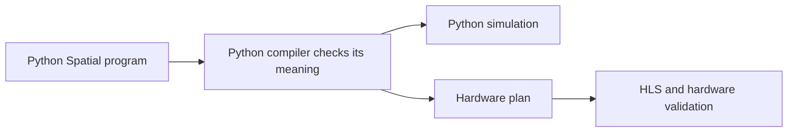

## The proposal

**Write Spatial and its compiler in Python. Check and simulate the program in Python first. Then lower the checked program to HLS.**

Python can implement the compiler algorithms we need. The remaining engineering questions are how we define Spatial's behavior, represent it, test it, and turn it into useful hardware. Team skill and coding capacity are assumed available.

## What writing a program means

Use normal Python for loading data, choosing sizes, running experiments, and checking results. Write accelerator kernels in a defined Python-syntax subset with Spatial types, memories, loops, reductions, and streams. The compiler reads that kernel source; it does not run the kernel as ordinary host Python.

That lets us preserve the information hardware needs: exact numeric types, when storage changes, which branch consumes a value, and which operations may run together. A builder supports generated programs through the same checks. The proposed first input routes are source files and raw notebook cells; their proposed API and checking rules are now recorded in the implementation design.

## What we learned from the research

- **The full language needs more than arithmetic.** We accounted for all 106 existing specification documents and checked a 124-path language/node/library baseline. The proposal includes state, aliases, reductions, streams, locks, memory transfers, and termination.
- **Some old behaviors disagree.** Simulator behavior alone cannot settle every numeric, queue, or cancellation rule. We recorded those differences and proposed explicit rules for review.
- **A compiler framework helps with structure.** We recommend xDSL, a Python framework, for the internal program representation. Spatial still owns its semantic checks. A small framework experiment confirmed that we must add our own ordering/dominance verification.
- **HLS comes after those rules.** HLS can schedule and synthesize the generated design, but our compiler must already preserve arithmetic, dependencies, memory behavior, and communication protocols.

The earlier Rust work remains useful evidence about Spatial and validation. The proposed compiler has no Rust core.

## The main tradeoff

This approach gives us a defined Spatial language hosted in Python, rather than unrestricted Python that happens to become hardware. It also means we must specify and test the compiler's rules carefully. Coding agents can do much of the implementation work, but tests still need independent expected values and effect traces.

Exact language behavior may require adapters or custom helpers on some HLS targets. We will report target limitations explicitly and introduce approximation only through a named, reviewed numeric profile. We will measure compiler speed and hardware quality separately.

## What is ready, and what comes next

The research package now includes five implementation blueprints: source/checking, numbers, state/HLS, package/validation, and libraries. They specify algorithms and interfaces, with small reproducible experiments and a cross-review log. The architecture, semantic changes and implementation sequence remain proposed. The documentation repo is the source of truth; the website publishes the same files with links back to the evidence.

No Python Spatial compiler or vendor hardware flow has been validated by this research. The first implementation step, after approval, is one complete path: read a composed memory kernel, check it, simulate it, explain errors, and save reproducible artifacts. We then expand reductions, numeric types, and stateful programs while beginning HLS on the checked subset.

**Approval requested at the meeting:** proceed with the architecture in [[D-28]], including review of the proposed semantic changes. The detailed implementation starts after that decision.

## Useful pages to show

[[00 - Implementation Design Index|Implementation design]] · [[07 - Python Implementation Readiness Audit|Readiness review]] · [[00 - Python Rewrite Index|Research home]] · [[D-28|Architecture decision]] · [[01 - Python Coverage Ledger|Full-language coverage]] · [[04 - Python Implementation Roadmap|Implementation sequence]] · [[02 - Python Research Review Log|Evidence and review findings]]
