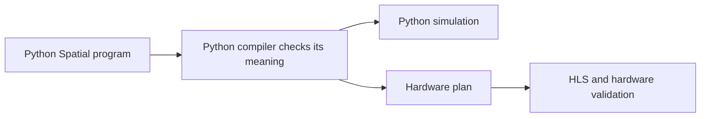

<a href="https://davidydu.github.io/spatial-research-site/presentation/python/" data-router-ignore target="_blank" rel="noopener noreferrer">Open the refreshed seven-slide presentation</a> · [[2026-10-01-python-professor-presentation-outline|Full speaker notes and evidence]].

The 7 October presentation follows one program from source to results, explains the shared checked program, and embeds the Excalidraw engineering map. It then shows how we will test generality, what has been implemented, and the next result we want before HLS. The main talk is about ten minutes.

## The proposal

**Write Spatial programs and the compiler in Python. Check and simulate the program first. Then build a checked hardware plan and lower it to HLS.**

Python can implement the compiler algorithms we need. Spatial still needs precise rules for values, memory, control and parallel work. The research defines those rules and how we will test them. Team skill and coding capacity are assumed available.

## What writing a program means

Use normal Python for loading data, choosing sizes, running experiments, and checking results. Write accelerator kernels in a defined Python-syntax subset with Spatial types, memories, loops, reductions, and streams. The compiler reads that kernel source; it does not run the kernel as ordinary host Python.

The [[PY-E002 - Spatial to Python Syntax Atlas|course syntax atlas]] makes this concrete: original Spatial next to proposed Python, with complete scalar, tiled-memory, reduction, FSM, GEMM and convolution examples. [[60 - Course Syntax and Compiler Trace]] follows those examples into the proposed compiler and records the source-level choices. These examples describe the intended language; they are not all implemented programs.

That lets us preserve the information hardware needs: exact numeric types, when storage changes, which branch consumes a value, and which operations may run together. The design also lets generated programs use a builder and reach the same checker. The proposed first source routes are files and raw notebook cells; their API and checking rules are recorded in the implementation design.

## One meaning, two uses

The central design choice is one immutable checked program. Reference simulation runs its meaning. Hardware planning chooses storage, scheduling, arithmetic realizations and interfaces while preserving that meaning. HLS receives the resulting target-specific design.

This separates three questions: Is the Spatial program valid? Does the implementation preserve its behavior? Is the resulting hardware useful? A passing Python simulation does not establish FPGA timing or resource use.

The presentation embeds the [[70 - Engineering Architecture Map|Excalidraw architecture map]]. Its overview shows this split; the full canvas connects it to the source reader, checker, simulator, hardware planner and shared rules. The map describes the proposed full architecture. Its colors identify responsibilities, not completed implementation.

## What we learned from the research

- **The full language needs more than arithmetic.** We accounted for all 106 existing specification documents and checked a 124-path language/node/library baseline. The proposal includes state, aliases, reductions, streams, locks, memory transfers, and termination. The [[01 - Python Coverage Ledger|coverage ledger]] keeps later capabilities visible while implementation starts with a smaller subset.
- **Some old behaviors disagree.** Simulator behavior alone cannot settle every numeric, queue, or cancellation rule. We recorded those differences and proposed explicit rules for review.
- **One Python representation should own the meaning.** The proposal uses immutable Python records shared by checking, simulation and planning. This gives every input route and execution path the same language rules. The representation study is supporting evidence; complete compiler performance is still unmeasured. xDSL remains optional for a specific backend pipeline that demonstrates a benefit.
- **HLS comes after those rules.** HLS can schedule and synthesize the generated design, but our compiler must already preserve arithmetic, dependencies, memory behavior, and communication protocols.

The earlier Rust work remains useful evidence about Spatial and validation. The proposed compiler has no Rust core.

## How we will test generality

The first target is a reusable subset of small memory programs: Int32 values, SRAM and DRAM views, transfers, nested loops, runtime branches and typed helpers. The compiler must handle their combinations through common language rules. It must not dispatch on a kernel name, lab number or whole-program pattern.

After a compiler revision is frozen, an independent reviewer will write a structurally unfamiliar valid program. It must work without a new compiler path. We will vary helper boundaries, nesting, shapes and aliases, and compare outputs and observable effects with independently derived expectations. If a failure requires a compiler repair, that case becomes a regression test and acceptance needs a fresh unseen composition.

Coding agents can implement the compiler, but agreement between implementations or reviewers is not enough. Tests need independent expected values and effect traces. The [[80 - Initial Compiler Goal|initial goal]] records these acceptance gates, including invalid-program diagnostics, source/builder/import agreement and an actual structural rewrite.

## The main tradeoff

This is a defined Spatial language hosted in Python. Kernel code follows that language's rules; ordinary Python handles data preparation and experiments. We must specify and test the boundary carefully.

Exact language behavior may require adapters or custom helpers on some HLS targets. We will report target limitations explicitly and introduce approximation only through a named, reviewed numeric profile. We will measure compiler speed and hardware quality separately.

## What is ready

The research package includes implementation blueprints for source/checking, numbers, state/HLS, package/validation, and libraries. The [[11 - Design Refinement Iterations|design refinement]] records the review findings and resulting changes. The documentation repository is the source of truth; the website publishes the same files with links back to the evidence.

David authorized the [[80 - Initial Compiler Goal|initial implementation experiment]] on 4 October. At the committed `spatial-py@f8a993b` checkpoint, the foundations include immutable program records and indices, exact numeric primitives, closed input validation, type and operation-layout rules, scalar normalization, and checks for value visibility and ordered effects. **236 component tests pass.** The initial-goal page and the implementation repository's support ledger record the checks and their limits.

The complete verifier, checked-program publication, memory checking and execution, source-to-simulation workflow, and post-freeze unfamiliar-composition gate are unfinished. The reviewed memory design is being implemented; a reviewed plan is not a passed runtime milestone. No HLS, RTL or hardware result is claimed.

## The next result and the meeting decision

The next result is one complete, reusable path: read a composed memory program, check it, prepare inputs, simulate it, explain errors, and save reproducible artifacts. The acceptance gates test both individual constructs and new combinations. A successful tiled-scale example alone does not complete the goal.

Once that subset works, we can build and validate its hardware plans, then lower them to HLS while adding later language families. Starting HLS for that subset does not require finishing the entire Spatial language first.

**For professor discussion:** does this programming model preserve the Spatial ideas we need, is the shared checked-program architecture the right foundation, and do these acceptance gates establish a useful first result? The pure Python direction is accepted. The initial implementation experiment is authorized. Professor adoption of the full [[D-28]] architecture and its proposed semantic changes remains a separate decision.

## Useful pages to show

[[70 - Engineering Architecture Map|Engineering map]] · [[80 - Initial Compiler Goal|Current implementation and acceptance gates]] · [[00 - Implementation Design Index|Implementation design]] · [[07 - Python Implementation Readiness Audit|Readiness review]] · [[00 - Python Rewrite Index|Research home]] · [[D-28|Architecture decision]] · [[01 - Python Coverage Ledger|Full-language coverage]] · [[04 - Python Implementation Roadmap|Implementation sequence]] · [[02 - Python Research Review Log|Evidence and review findings]]

[Research repository](https://github.com/davidydu/spatial-research) · [Documentation website](https://davidydu.github.io/spatial-research-site/) · [Website repository](https://github.com/davidydu/spatial-research-site) · [Implementation repository](https://github.com/davidydu/spatial-py/tree/work/initial-reference) (requires repository access)
