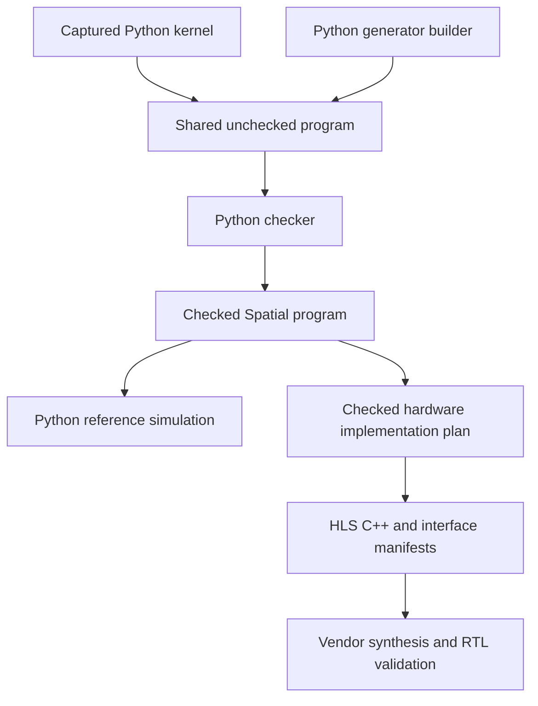

## Chosen structure

Propose immutable Python source/unchecked records, custom Spatial dialects on xDSL for checked semantic and implementation programs, a Python reference simulator, and a Python backend that emits HLS C++ and integration manifests. Python owns all Spatial-specific typing, arithmetic, effects, protocols, transformations, and target legality. xDSL supplies compiler infrastructure; it does not decide what a Spatial program means.

This is a proposed architecture, not an implemented pipeline. xDSL is recommended for inspectable Python region/SSA infrastructure; the proposed CPython/xDSL/dependency lock and clean-wheel reproduction are now fixed in [[40 - Package and Conformance Blueprint]]. Custom Python IR is the fallback if measured framework costs or representation conflicts justify it. Native MLIR adapters remain possible; native storage by itself does not move Python-defined Spatial rules to native code. No Rust semantic core is proposed.

## Representation and verification

| Boundary | Required invariant |
|---|---|
| Source/template | Immutable text/tokens/origins, explicit frozen dependencies and accepted grammar; exact literal lexemes retained |
| Unchecked program | Frozen ordered declarations/regions, symbols/handles/views/meta inputs, effect attachments, origins; no legality implied by construction |
| Checked semantic program | Typed regions/values, dominance, effect order, aliases/lifetimes/initialization, numeric/protocol versions, and a complete requirement ledger |
| Checked implementation plan | Explicit lanes/masks/controllers/continuations, channels/arbiters, banks/ports/versions, numeric realizations, ABI, and correspondence to semantic obligations |
| Emission | No unresolved required operation or target obligation; stable artifacts, source maps, capabilities, constraints, and tool dependency manifest |

Framework verification is necessary but insufficient. Spatial checks value dominance, token linearity/joins, capability escape, numeric properties, region results, effects, lifetimes, initialization, aliasing, reduction policy, and task protocols. Requirements have explicit dispositions: proved, invocation precondition, supported runtime guard, unknown, or rejected. Unknown does not authorize lowering. A checked reference program can still lack a target capability.

Checked snapshots expose queries and operations, not live mutable framework objects. Passes clone private candidates, transform, verify, and publish a new revision. Failed passes leave the previous revision intact. Attributes/properties and attached metadata must be immutable owned payloads because copying an outer graph does not freeze arbitrary nested Python objects. Runtime state belongs to an invocation, never to the shared checked graph.

## Pass and effect obligations

Normalize source and builder into one ordering model before optimization. Use explicit order tokens for stateful/faulting operations, selected branch joins, and loop/helper threading. Concurrent tasks retain separate chains. Effects name backing/generation, region or unknown access, guards, task/order domain, and protocol kind. Reads that may fault and operations that may block, consume, draw randomness, or observe mutable status are not generic pure expressions.

Only approved total-pure operations enter generic CSE/DCE/speculation. Ordinary unobserved floating status is diagnostic metadata; language faults and explicit observed-status operations are observable. Reduction regrouping requires the adopted typed law or fixed topology and preserves contribution effects separately.

Each pass declares prerequisites, changes, preserved facts, invalidations, and checks. Semantic properties live in the program. Inferred facts live in revision/dependency-keyed analysis tables. Deleting or rewriting an operation must not discard an unmet requirement. Banking, scheduling, retiming, and buffering may iterate through implementation revisions; they must preserve logical values, effects, lifetime, capacity, and termination policy.

Use a versioned canonical Spatial schema for interchange and caching. Import rejects unknown fields/tags, malformed identities, and violated invariants. Generic xDSL text is for inspection; pickle and Python AST objects are not trusted interchange. Separate source acquisition/provenance, checked semantic, build, and run keys. Tool/target versions, semantic profiles, actual aliases, session/environment state, and randomness belong in the appropriate key.

Reference component models serialize as versioned model IDs with code/dependency hashes and explicit state/input/environment schemas. A reviewed Python registry resolves them outside the IR; closures and mutable host globals are not hidden model state. Registry admission has a declared trust boundary and independent conformance tests. Missing/mismatched model versions diagnose rather than silently rebind.

## HLS responsibility

The first backend family is AMD Vitis HLS, with initial proposed profile `vitis-2025.1-z020-10ns` defined in [[30 - State Simulator and HLS Blueprint]]. That historical-tool baseline is a target for future Python validation, not a current Python support claim. Research documents retain the displayed versions of the primary documentation they used; no single unrestricted release compatibility is claimed.

Spatial chooses numerical normalization, guards, reduction topology, aliases, storage lifetime, dependency/protocol order, semantic capacity, host ABI, and hard versus soft constraints. HLS tools bind and schedule legal emitted structures and report achieved behavior/resources. A pragma request is not achieved II, and achieved II is not semantic equivalence.

Ordered control maps to structured loops/branches. Communicating control selects a supported static dataflow network, persistent tasks, or an explicit protocol machine/component route. The selected route must preserve start/join, bounded readiness, arbitration, fault/drain/cancel, and reset. An integrated component needs a checked interface, Python reference model, and independent RTL evidence. A blackbox is not permission to hide an undefined operation.

Refinement includes progress as well as allowed event order. Under recorded fairness/environment assumptions, hardware must not introduce a stable deadlock or infinite internal stall where the source owes a transition or completion. Preserve allowed indefinite external waits and source nondeterminism without asserting universal source termination. Completion/fault/wait classifications and bounded adversarial progress tests accompany trace checks; a valid prefix alone cannot pass a route's gate.

Memory planning must preserve logical bounds and backing identity while deriving banks, ports, duplication/version coherence, buffer reuse, physical packing, and transfer transactions. Ordered overlapping copies and repeated scatter destinations keep their contract. Dynamic allocation needs a bounded pool/service route. Unknown overlap can require serialization, guards, or target rejection; it cannot justify dropped writes or a false dependence pragma.

Numeric lowering must preserve normalization at each declared operation. Select a vendor primitive only with a matching adopted profile or a proven adapter/domain restriction; otherwise emit a checked bit/helper implementation or diagnose target capability. Ordinary multiplication-plus-add is not implicit FMA. Resource/width/time limits are target constraints, not silent numerical changes.

Hardware faults require static proof of impossibility, validated invocation preconditions, or synthesizable guards and an error/drain protocol. A simulation exception or C assertion alone is insufficient. Earlier committed external writes remain committed. Device errors map operation IDs back to captured source; outputs are marked incomplete.

## Implementation blueprints

[[00 - Implementation Design Index]] links the concrete source/checker, numeric, state/HLS, package and library designs. They include exact structured-region/token verification, pass requirement transfer, SpatialJSON-v1, source/builder/serialized unchecked input, public workflow signatures, dependency hashes and independently specified fixtures. S0 implements these choices after adoption instead of inventing a new schema or frontend contract. The initial target uses conservative capability records; every newly enabled vendor route still requires its own executable evidence.

## Evidence and implementation gates

Keep these outcomes separate: reference execution, generated C++ checks, vendor C simulation, RTL/protocol simulation, synthesis schedule/resource reports, physical timing, and board tests. Every claimed capability names its program/profile/inputs/environment and artifact/tool hashes. Unexecuted design studies do not receive executed-support labels.

R007 fixes feedback workloads and targets before benchmarking, with warmups, repeated runs, median/p95 and memory reporting. Independent numeric vectors, state/event expectations, and bounded protocol exploration supplement shared checker/simulator code. Full scope and migration follow R005 and its 106-document coverage ledger. Implementation follows [[04 - Python Implementation Roadmap]] after professor review; no production compiler work is authorized by this proposed contract.
