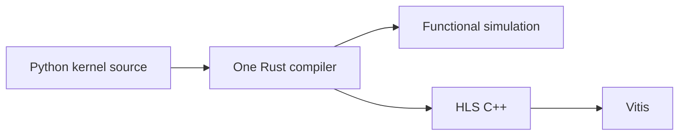

# Spatial professor presentation

> [!important] Historical presentation
> On 30 September 2026, David reported that the professor chose a pure Python rewrite instead of the Rust-core proposal presented here. See [[2026-09-30-pure-python-programming-model|the current direction and research sequence]]. The outline below is preserved as the meeting record.

## Purpose and central message

Present the research result and obtain approval to implement the selected architecture. The professor already knows Spatial, so begin with our progress and the decision it supports. Keep language mechanics and the full research comparison available as supporting material.

**Central message:** Students describe hardware using Python syntax. One Rust compiler owns the Spatial rules and supplies the checked program for simulation and hardware generation.

This describes the **proposed architecture**. The existing Rust prototype and historical HLS results establish progress; they do not mean this full pipeline already exists.

The user approved the outline and visual style, then requested implementation with plain wording. The web presentation is implemented in the site repository's `presentation/` directory. This note records the content plan; it does not record professor approval of the compiler architecture.

<a href="presentation/index.html" data-router-ignore target="_blank" rel="noopener noreferrer">Open the presentation</a>. Use arrow keys or the numbered navigation to change screens. Notes and sources open in separate panels. The documentation screen opens a tour with a return control and a saved homepage preview.

## Story at a glance

Six parts, seven screens, approximately nine minutes before discussion. Part 1 has two screens so compiler work and research documentation both receive a clear, brief demonstration.

| Part / screen | Headline | What the professor should take away | Time |
|---|---|---|---|
| 1A — Progress | A working Rust prototype, with validated HLS paths | We have implementation assets and concrete backend evidence to build on | 1:00 |
| 1B — Research foundation | An inspectable research record | The repository preserves the research; the website makes it easy to review | 0:45 |
| 2 — Lesson | The next step is compiling compositions | The central engineering change is moving beyond whole-program recognition | 1:15 |
| 3 — Architecture | Python for authoring. One Rust core for meaning. | One checked program supports simulation and hardware generation | 2:00 |
| 4 — Rationale | Choose the student language and compiler language separately | This split serves the student workflow and preserves useful compiler work | 1:30 |
| 5 — First milestone | Prove one complete semantic path | The first implementation step is small, measurable and tests generality | 1:30 |
| 6 — Approval | Approve the architecture and staged delivery | We are asking for a concrete implementation direction | 0:45 |

Opening, spoken over screen 1A: “We now have a Rust prototype and an organized research base. The main conclusion is to use Python for student authoring, with one Rust core owning Spatial semantics. I will show what we have built, what it taught us, and the next implementation step I am asking you to approve.”

## 1A — What we have accomplished: Rust prototype

**Question answered:** What tangible progress have we made?

**On screen:**

- Rust parsing and checking infrastructure, with source diagnostics.
- HLS generation for selected program families.
- Historical vendor checkpoint: **39 programs passed HLS simulation and synthesis; 37 fit the resource budget.**

**Visual:** A restrained three-stage progress strip: source → Rust prototype → selected HLS outputs. Beside it, one small, authentic example of source checking or a diagnostic. Show the checkpoint numbers in one compact evidence panel. Python authoring belongs on the proposed-architecture screen.

**Visible qualification:** “July 2026 checkpoint · 2 over budget · 14 initiation-interval caveats · no board execution.” The 14 caveated cases can overlap the resource-fit categories. Keep the date and qualification attached to the numbers.

**Spoken emphasis:** “This gives us real compiler infrastructure, working backend paths and regression examples. The limitation is that much of the current pipeline still recognizes particular whole-program shapes.”

**Evidence:** [[2026-06-27-rust-spatial-rewrite-roadmap]] records the exact July 5 checkpoint and its limits; [[D-26-05-boundary-design]] and [[D-26-professor-brief]] distinguish the implemented text `check` command from the proposed general compiler and delivery interface. When building the presentation, use actual output from an existing accepted fixture or recorded diagnostic, with its revision; do not fabricate a transcript.

**Transition:** “Alongside the prototype, we built a research record that explains the language rules and the decisions behind the next design.”

## 1B — What we have accomplished: documentation repository and website

**Question answered:** Where does the research live, and how can the professor inspect it?

**On screen:**

- **Research repository:** specifications, source evidence, experiments and decisions.
- **Documentation website:** a readable, linked route through the same research.
- **Review path:** recommendation → supporting evidence → language specification.

**Visual:** Two large views: a small source-repository tree on the left and a real website preview on the right. The source tree highlights only `10 - Spec`, `20 - Research Notes`, `30 - HLS Mapping` and `35 - Python Surface Mapping`. A small caption identifies `spatial-research-site` as the website infrastructure. This makes the roles of both repositories clear without introducing a publishing-system tutorial.

**Demonstration, 30–45 seconds:**

1. Show the research repository's organization briefly.
2. Open the site's reviewer entry point and the professor brief.
3. Follow one evidence link, then show that the language specification is accessible from the same site. Return to the presentation.

The entire tour should prove one point: the recommendation is inspectable. Preselect one evidence page; avoid browsing several long notes during the talk. The Python mapping overview is a useful choice because it connects the authoring recommendation to the hardware information the frontend must preserve.

**Spoken emphasis:** “The documentation is part of the research result. The repository keeps the specification and evidence versioned; the website lets you review the recommendation and follow its reasoning without navigating the whole codebase.”

**Resources:** [Research repository](https://github.com/davidydu/spatial-research), [website repository](https://github.com/davidydu/spatial-research-site), [public documentation site](https://davidydu.github.io/spatial-research-site/), [[index|Reviewer entry point]], [[D-26-professor-brief]], [[00 - Python Mapping Overview]], [[10 - Spec/00 - Spec Index|Specification index]].

**Presentation preparation:** The latest research and site updates are currently local; the latest public deployment is not confirmed. Prepare the tour from a matching local website build and source snapshot. Switch to the public links only after the intended pages are published and checked. Keep screenshots of the same revision as a fallback. These are preparation notes, not material for the main talk.

**Transition:** “Taken together, the prototype and research point to one central architectural change.”

## 2 — What the prototype taught us

**Question answered:** Why does the next phase need an architectural change?

**On screen:**

- Today: recognize supported whole-program shapes.
- Next: check and combine supported hardware constructs.
- Reuse the prototype's useful infrastructure and evidence.

**Visual:** Two rows. The upper row shows a few complete program shapes passing through family recognition. The lower row shows memory, loops, arithmetic and state combining into a checked program. Label the rows **Prototype today** and **Proposed next step**. Highlight one changed combination to explain what generalization means.

**Spoken emphasis:** “The prototype is useful, but adding another recognizer for every new program will not give us a general compiler. We need rules for the parts and for how those parts compose. A student should be able to change a supported tile size or combine supported constructs without us adding another whole-program case.”

Explain what survives in one sentence: parsing infrastructure, selected numeric rules, backend idioms and regression evidence remain useful. They must be integrated and revalidated as the general pipeline develops.

**Evidence:** [[D-26-final-architecture]] and [[2026-07-07-fundamental-design-review]]. This is a diagnosis of the current architecture and a proposed direction; it is not a claim that arbitrary Spatial compositions already work.

**Transition:** “That leads to the architecture I recommend.”

## 3 — The architecture we recommend

**Question answered:** What exactly are we proposing to build?

**On screen:** **Python for authoring. One Rust core for meaning.**

**Main diagram, labeled Proposed:**

**Supporting line:** “Python syntax follows explicit Spatial hardware rules.”

**Reveal sequence:**

1. **Author:** Students write a restricted Python-syntax kernel. The frontend reads the source without executing it.
2. **Check:** Rust resolves names, constants, types and hardware legality, producing one checked controller tree. In speech, call it “one checked program representation.”
3. **Use:** That checked program feeds exact functional simulation or structural HLS generation. Ordinary Python testbenches and notebooks prepare data, invoke tooling and check results.

The main visual needs only the boxes above. A small optional “Inside the compiler” detail reveals source capture → shared checker → checked controller tree. This preserves the big picture while answering ownership questions precisely.

**Spoken emphasis:** “Yes—this is a Python frontend and a Rust compiler. Python is the language students write. Rust is where the hardware meaning is defined and checked. Both simulation and hardware generation start from that same checked meaning.”

**Boundary to keep clear:** The frontend supplies unresolved source structure and original tokens/locations. It does not run kernel functions to discover a graph or become a second semantic checker. Functional simulation does not promise cycle accuracy. The diagram shows the selected design, not a completed pipeline.

**Evidence:** [[D-26-final-architecture]], especially source capture, ownership and the semantic pipeline; [[D-26-05-boundary-design]].

**Transition:** “The reason for this split is that the student-facing language and the compiler implementation solve different problems.”

## 4 — Why Python frontend plus Rust core

**Question answered:** Why is this the selected architecture?

**On screen:**

| Choice | Reason |
|---|---|
| Python authoring | Familiar syntax and an ordinary Python testbench workflow |
| Rust semantic core | Retains useful compiler infrastructure and native interpreter headroom |
| One shared checker | Keeps language rules and diagnostics consistent across the pipeline |

**Visible tradeoff:** “Familiar syntax still needs an explicit guide to Spatial hardware semantics.”

**Visual:** Three concise reasons around the architecture diagram; avoid a language ranking chart. An optional evidence control opens the alternatives and experiment details.

**Spoken emphasis:** “We can give students Python syntax without implementing the compiler in Python. This choice preserves useful Rust work and execution headroom while giving us a familiar authoring environment. The integration work is justified by that chosen student workflow. We still need to teach the hardware rules clearly.”

If asked about alternatives: an external DSL offers a simpler frontend boundary; a Python core is technically credible. The recommendation selects a combination under our stated objectives and capable-team assumption. Familiarity is a design motivation, not a measured learning advantage. The bounded interpreter experiment supports headroom for the tested Rust route, not a universal language-speed claim or an end-to-end hardware speedup.

**Evidence:** [[D-26-professor-brief]], [[2026-09-28-d26-research-extension]], [[D-26-02-student-surface-comparison]], [[D-26-12-simulator-spike]].

**Transition:** “We can test the central architectural claim with a small first implementation.”

## 5 — What we will implement first

**Question answered:** What happens after approval, and how will we know it worked?

**On screen:** **One dense tiled-scale program, through the complete semantic path.**

Show Python source → shared checking → checked program → exact simulation, with three success indicators:

- Equivalent Python and internal reference forms have the same checked meaning.
- Interpreter outputs match an independent reference exactly.
- Renaming, changed tiling and recomposition work without another whole-program recognizer.

**Visual:** One large first milestone, followed by two smaller future stages: **Broader semantics** → **Structural HLS and course delivery**. The future stages are summaries of the detailed gates, not a promise to postpone all backend work until every interpreter family is complete.

**Spoken emphasis:** “The first milestone proves that we have built a compiler for supported compositions. It also tests the Python-to-Rust boundary with a real program. Once a family's semantic checks pass, we can develop its structural HLS path and validate the generated hardware code.”

**Supporting acceptance checks:** Kernel source is never executed during capture; errors point to the correct source location; invalid cases fail for the expected reason. The equivalent external form is internal conformance infrastructure, not a second public teaching language.

**Scope:** First freeze the source subset and boundary contract. The first complete semantic slice ends at exact interpretation. Fresh HLS validation, all 39 corpus programs and course packaging belong to later gates; retain those commitments without presenting them as part of the first deliverable.

**Evidence:** [[D-26-final-architecture#Implementation sequence after approval|Full delivery gates]].

**Transition:** “That is the direction and first proof point I am asking you to approve.”

## 6 — The approval we are requesting

**Question answered:** What decision should the professor make today?

**On screen:**

> Approve restricted Python source over one Rust semantic core, with staged validation before course release.

Below it, repeat the small architecture diagram and one next-action line: **Begin with the source contract and one complete semantic slice.**

**Spoken close:** “The research has produced a concrete architecture recommendation. We have a prototype and an inspectable evidence base to build on. I am asking for approval to proceed with this architecture and its validation gates, starting with the first semantic slice.”

Leave the diagram visible for discussion. The approval concerns architecture and delivery commitments. General semantics, course readiness and new hardware results remain work to demonstrate.

**Evidence:** [[D-26-professor-brief#Approval statement|Approval statement]] and [[D-26-final-architecture]].

## Supporting material, outside the main story

Keep these accessible from relevant screens or a short appendix:

- Exact current compiler capability and one real diagnostic.
- Historical 39-program checkpoint, resource-fit counts and initiation-interval qualifications.
- The strongest alternative architectures and why we selected this one.
- Matched interpreter experiment, its exact scope and reproducibility archive.
- Source nonexecution, hardware-semantics differences and unresolved-AST boundary.
- Complete delivery gates, internal paired fixtures, wheels and course-release commitments.

No Spatial introduction, comprehensive feature inventory, full six-cell architecture matrix, test-count headline or unqualified speedup headline is needed in the main talk.

## Web presentation design direction

Use the quiet editorial qualities discussed from Thinking Machines Lab: generous white space, dark text, restrained typography, fine rules and clear diagrams. Give Spatial its own title and visual identity. Each screen gets one headline, one primary visual and at most three short points; keep speaker notes separate from the projected view.

Use arrow-key navigation, a subtle position indicator, the three-step architecture reveal and optional evidence links. Provide a deliberate way to enter and return from the documentation tour. All essential claims remain readable without interacting. Avoid decorative animation or a dashboard layout.

Use explicit status text where it matters: **Implemented prototype**, **Historical validation**, **Proposed architecture**. Do not rely on color alone. Confirm the website demo and its fallback images show the same research revision before presenting.

The web presentation implements this plan with shorter projected copy. The site build includes both the documentation and presentation. Latest changes are local until publication access is restored; use the local build for the current review. Compiler architecture implementation still awaits professor approval.
